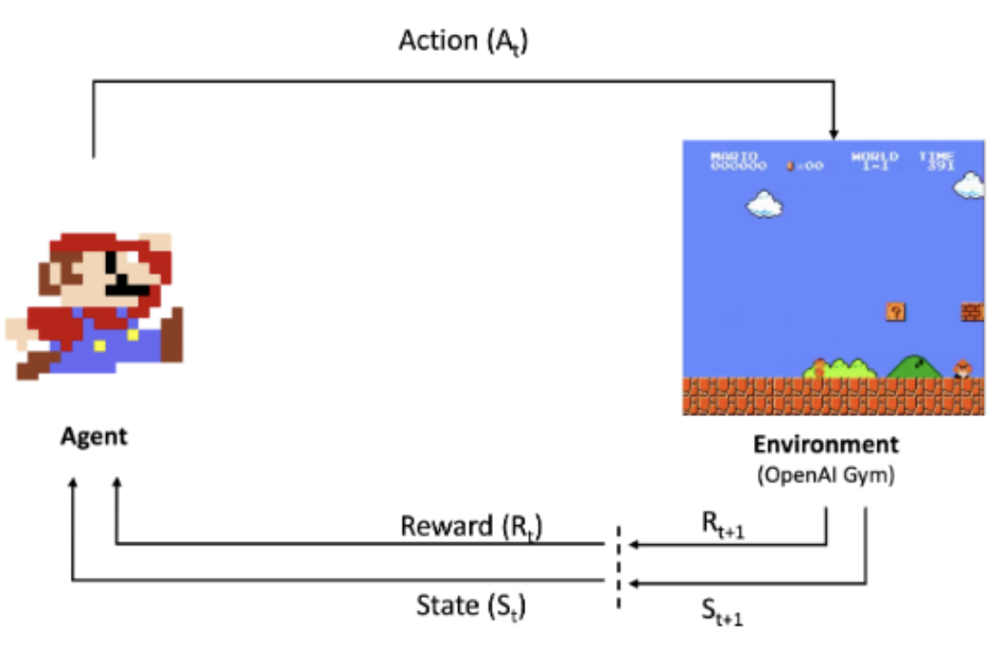
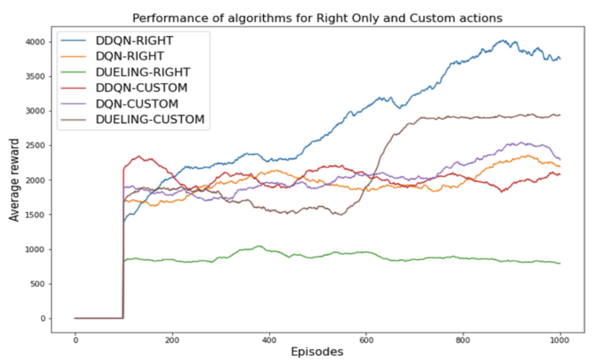

# Reinforcement Learning (RL) on Super Mario Bros

Final project for CM50270 Reinforcement Learning (Semester 2, 2022) at the University of Bath.

Grade: 80/100 (Distinction)

## Problem Description
In this project, reinformcement learning agents are trained to play Super Mario Bros. The agents are trained on the [OpenAI gym-super-mario-bros environment](https://github.com/Kautenja/gym-super-mario-bros).

[

](./link/to/sql/file)

Refer to the [video presentation slides](video_presentation_slides.pdf) for a high-level summary of the project. Detail discussion can be found in the [final report](https://github.com/sskyau/rl-super-mario/blob/main/Project%20Report.pdf). 

## Agents Trained

Three RL agents are trained in the project, namely **DQN**, **DDQN** and **Dueling DQN**. To simplify the training process, only the right_only action and a custom action set which contain 5 and 2 actions respectively are made available to the RL agents. 

#### Rolling average rewards gained by the agents during training

[

](./link/to/sql/file)
